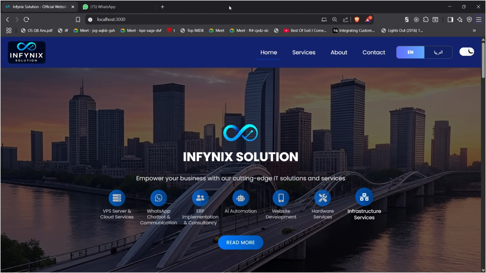
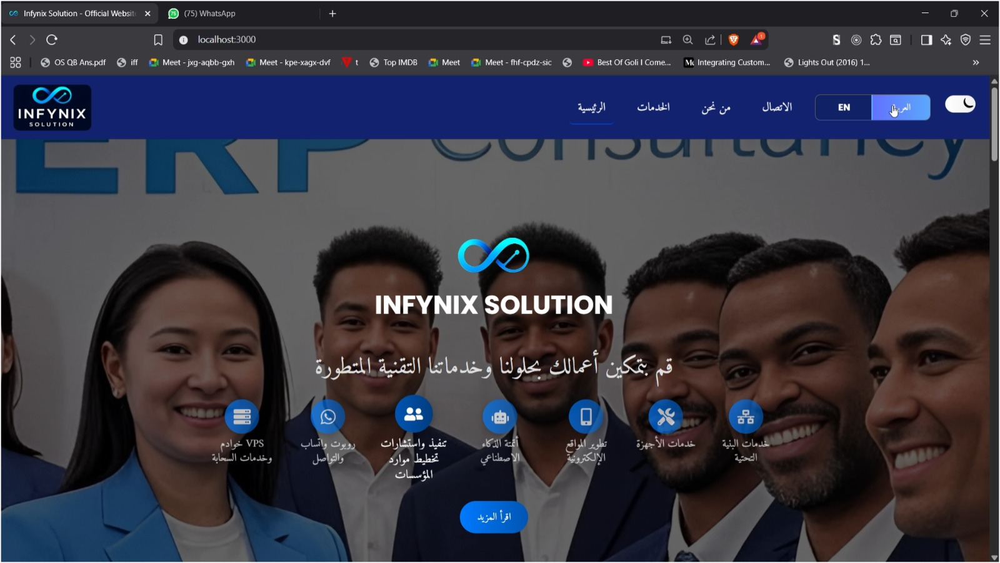
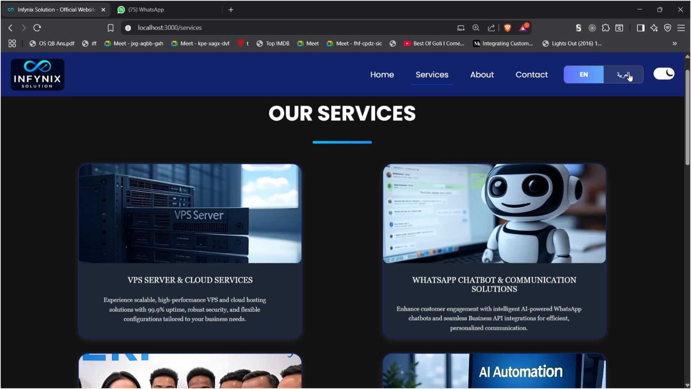
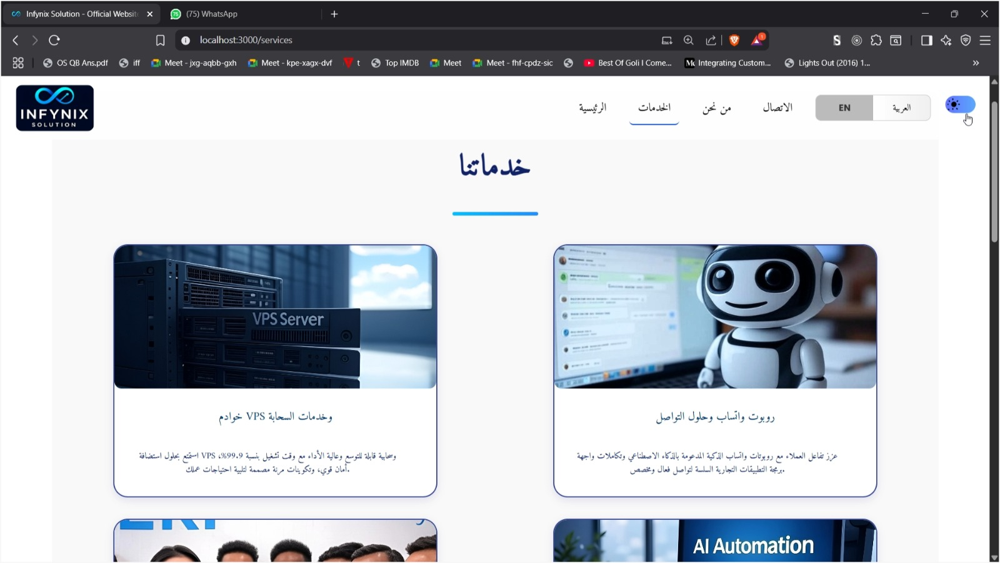
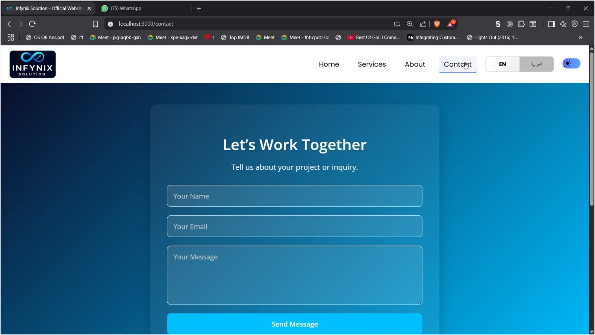
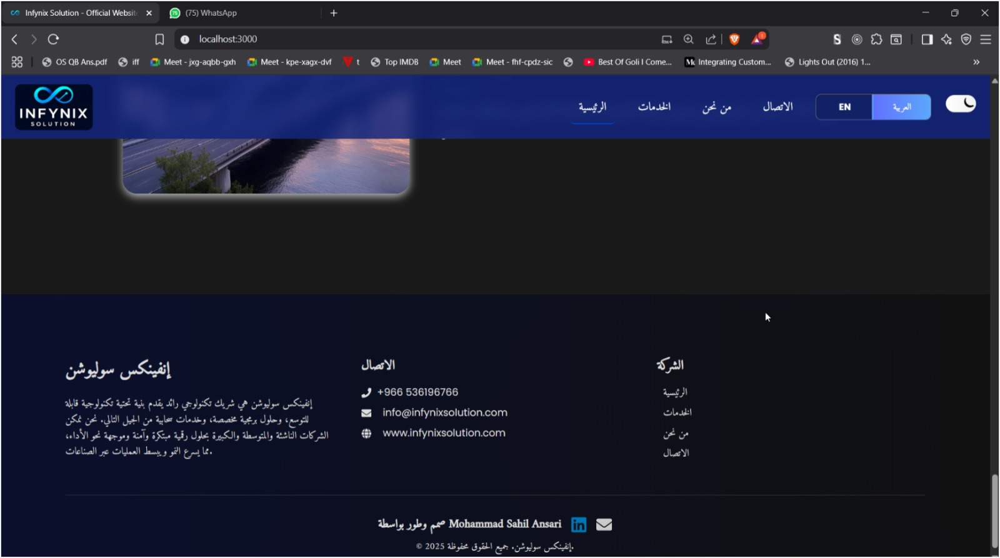

# 🌐 Infynix Solution

Infynix Solution is a modern bilingual (English/Arabic) tech website built with **React.js** and **Flask**.  
It features a professional Saudi-style dark theme with gradient backgrounds, a **dark/light mode toggle**, and dynamic translation between **English** and **Arabic**.  

The project also integrates a **Flask backend** for handling authentication (login form) and contact form submissions.

---

## 🚀 Features
- 🌗 **Dark Mode / Light Mode** toggle with smooth transitions  
- 🌍 **Bilingual Support (EN/AR)** – dynamic language switch  
- 🖼️ **Full-page Image Carousel** with stylish navigation arrows  
- 📩 **Flask Integration** for contact & login form submissions  
- 🎨 Modern **gradient UI design** (deep navy → cyan blue)  
- 📱 Fully responsive (mobile, tablet, desktop)  

---

## 📸 Screenshots

<p align="center">
  
  
  
</p>

<p align="center">
  
  
  
</p>

---
## 🎥 Demo Video
👉 [Watch Demo](images/Sample_Video.mp4)  

<p align="center">
  <a style = "height:30,width:70" href="images/Sample_Video.mp4" download="Infynix_Demo.mp4">
    
  </a>
</p>

---

## 🛠️ Tech Stack
### Frontend
- **React.js** with **TailwindCSS**
- **i18next** for English/Arabic translations
- **Framer Motion** for animations
- **ShadCN UI** + **Lucide Icons**

### Backend
- **Flask** (Python)
- REST API for login & contact forms
- **SQLite / MySQL** (configurable)

---

## 📦 Installation

### Clone the repository
```bash
git clone https://github.com/yourusername/infynix-solution.git
cd infynix-solution
